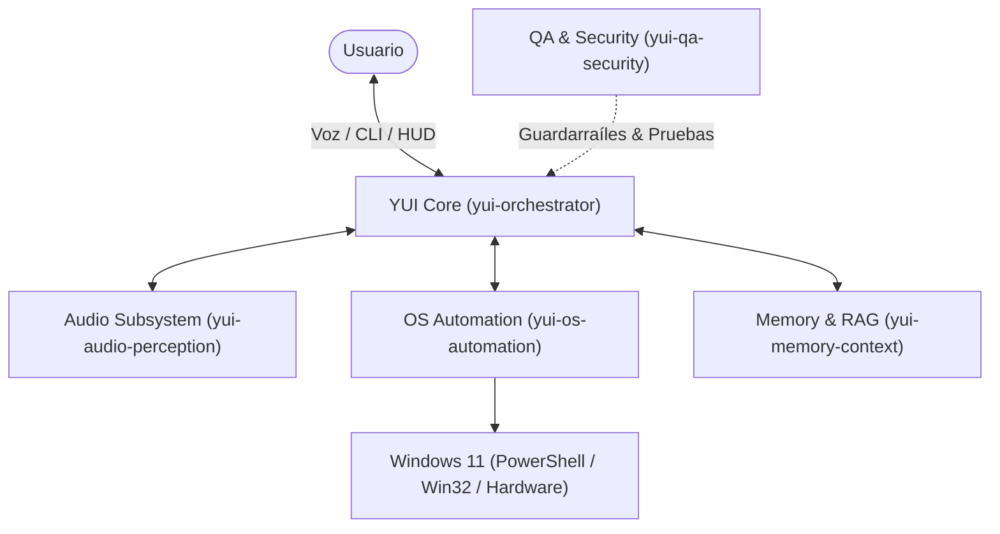

# YUI — Next-Gen Autonomous AI Companion & OS Operator

[](https://microsoft.com)
[](https://python.org)
[](.agents/agents/)
[](yui/system/security.py)

**YUI** es un asistente autónomo de sistema operativo de nueva generación para Windows, diseñado para materializar la visión de un compañero inteligente con iniciativa ejecutiva real (estilo *Jarvis* / la evolución que debió representar *Cortana*). Opera bajo una arquitectura **multi-agente nativa**, combinando telemetría de hardware, automatización de escritorio, control por voz y memoria persistente.

---

## 🏛️ Arquitectura del Sistema



Consulta el documento exhaustivo de diseño técnico en [docs/architecture.md](docs/architecture.md).

---

## 🤖 Enjambre de Agentes Antigravity

El proyecto implementa el estándar **Team Architecture** de Antigravity dentro de `.agents/agents/`:

* **[`yui-orchestrator`](.agents/agents/yui-orchestrator/agent.md)**: Coordinador cognitivo principal. Descompone instrucciones y sintetiza respuestas.
* **[`yui-os-automation`](.agents/agents/yui-os-automation/agent.md)**: Especialista en PowerShell, procesos y telemetría de hardware.
* **[`yui-audio-perception`](.agents/agents/yui-audio-perception/agent.md)**: Pipeline de audio (Wake-word, Faster-Whisper, Edge-TTS).
* **[`yui-memory-context`](.agents/agents/yui-memory-context/agent.md)**: Almacenamiento relacional en SQLite y base vectorial LanceDB.
* **[`yui-qa-security`](.agents/agents/yui-qa-security/agent.md)**: Análisis estático de riesgo en comandos y certificación de calidad.

Para gestionar o inspeccionar los agentes en el entorno de desarrollo, utiliza el comando interactivo:
```bash
/agents
```

---

## 🚀 Inicio Rápido

### 1. Clonación y Requisitos
* Windows 10 / 11 (64-bit)
* Python 3.11 o superior instalado y agregado al PATH

### 2. Configuración de Entorno Virtual
```powershell
python -m venv .venv
.\.venv\Scripts\Activate.ps1
pip install -e ".[dev,windows-full]"
```

### 3. Variables de Entorno
Copia la plantilla y configura tus claves deseadas:
```powershell
Copy-Item .env.example .env
```

### 4. Ejecución del Asistente
```powershell
# Iniciar sesión interactiva de terminal con interfaz enriquecida
python -m yui.main chat

# Consultar telemetría de hardware en tiempo real
python -m yui.main status

# Procesar una instrucción directa
python -m yui.main ask "dime el estado del sistema"
```

---

## 🧪 Pruebas y Certificación de Seguridad

Para ejecutar la batería de pruebas de los subsistemas y filtros de comandos:
```powershell
pytest -v
```

---

## 📁 Estructura del Repositorio

```
Jarvis/ (YUI)
├── .agents/
│   └── agents/               # Enjambre de agentes Antigravity
│       ├── yui-orchestrator/
│       ├── yui-os-automation/
│       ├── yui-audio-perception/
│       ├── yui-memory-context/
│       └── yui-qa-security/
├── docs/
│   └── architecture.md       # Especificación técnica y roadmap
├── tests/
│   ├── __init__.py
│   └── test_core.py          # Batería de pruebas unitarias
├── yui/
│   ├── __init__.py
│   ├── config.py             # Configuración Pydantic
│   ├── main.py               # CLI Typer de punto de entrada
│   ├── audio/                # Motores de voz y audio
│   ├── core/                 # Orquestador central
│   ├── interfaces/           # TUI y consolas Rich
│   ├── memory/               # Almacén SQLite y LanceDB
│   └── system/               # Automatización y seguridad Windows
├── .env.example
├── .gitignore
├── pyproject.toml
└── README.md
```

---

## 🛡️ Licencia
Proyecto desarrollado bajo licencia MIT. Consulta el código fuente para detalles adicionales.
