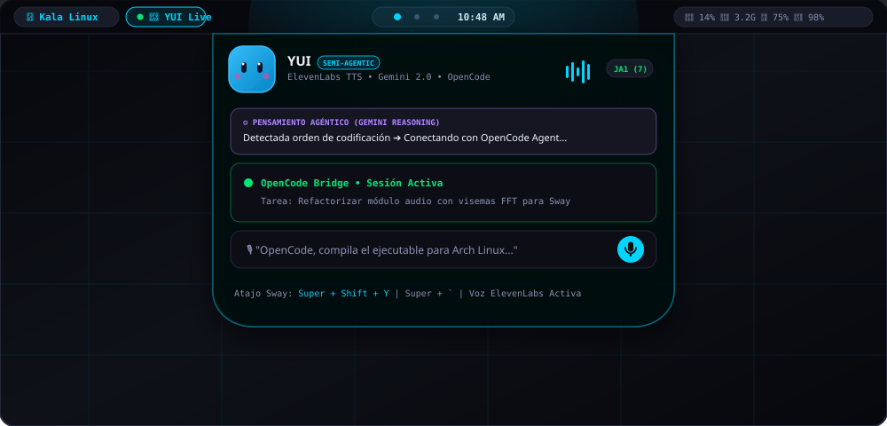
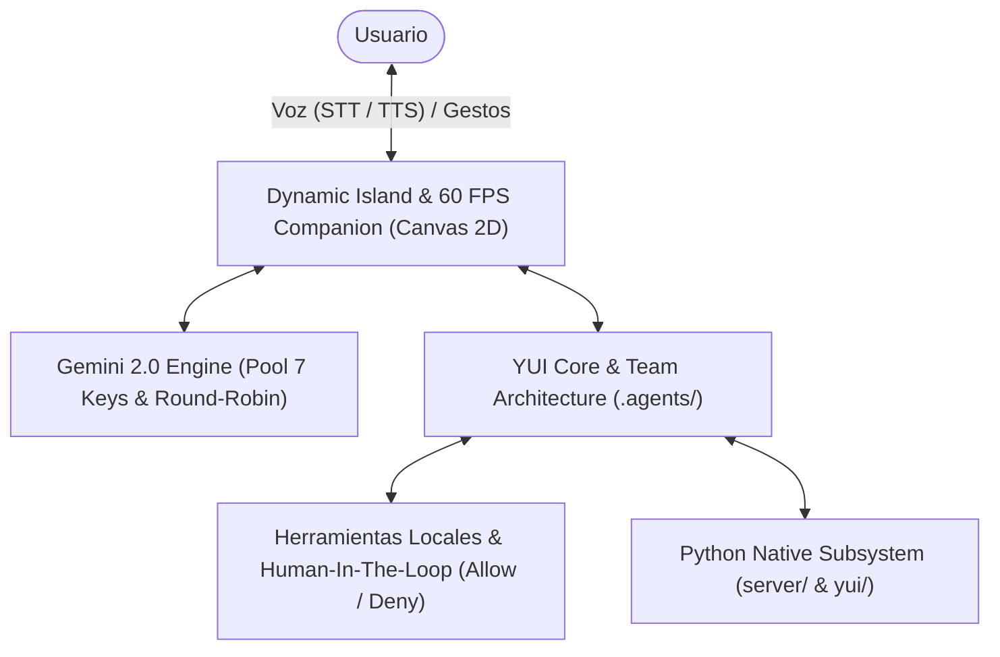

<div align="center">


# YUI — Next-Gen Autonomous AI Companion & Notch Operator

**Un compañero inteligente y adorable que vive en tu notch/pantalla y opera tu sistema, potenciado por Google Gemini.**

Inspirado en el diseño y calidez de [Coucou](https://github.com/Louis-CFM/coucou) (Mochi) y la potencia agéntica de Jarvis. **YUI escucha tu voz (STT), piensa paso a paso (Reasoning con pool multi-key), ejecuta herramientas del sistema y te responde hablando de manera natural (TTS con expresiones faciales a 60 FPS).**


<br>



</div>

---

## 🏛️ Arquitectura del Sistema



---

## ✨ Capacidades Principales

### 1. 🎙️ Escucha (Speech-to-Text en Vivo)
* **Reconocimiento continuo de voz** con Web Speech API y Faster-Whisper.
* **Ondas reactivas de audio**: El notch refleja la amplitud y tono de tu voz en tiempo real.
* **Interrupción instantánea (*Barge-in*)**: Si comienzas a hablar mientras YUI está respondiendo, se detiene de inmediato para escucharte.

### 2. 🧠 Piensa (Gemini 2.0 Flash Reasoning & Semi-Agentic Loop)
* **Traza de razonamiento (*Thinking trace*)**: Visualiza los pensamientos y deducciones de YUI mientras planifica su respuesta.
* **Pool Multi-Key de Google AI Studio**:
  * Balanceador de carga Round-Robin para evadir límites de cuota (RPM/TPM).
  * Conmutación por error automática (*Failover*) si una clave recibe un error `429 (ResourceExhausted)`.
* **Herramientas Agénticas Nativas**:
  * `get_system_status`: Inspección de CPU, memoria, kernel y uptime.
  * `get_weather_forecast`: Clima meteorológico en tiempo real.
  * `inspect_dropped_file`: Análisis multimodal de archivos arrastrados al notch.
  * `execute_shell_command`: Comandos de terminal Linux / PowerShell.
* **Semi-Agéntico con Human-in-the-Loop (HITL)**:
  * Si una acción tiene impacto en el sistema, YUI muestra una tarjeta flotante en el notch con **Permitir** o **Denegar** para que tú tengas siempre el control total.

### 3. 🗣️ Habla (Text-to-Speech con Visemas)
* Síntesis vocal natural con modulación de velocidad y tono.
* Sincronización labial y elástica: La boca y el cuerpo de YUI reaccionan al ritmo de las sílabas habladas.

### 4. 🎭 Un Personaje Vivo a 60 FPS (Canvas 2D)
* **Ojos proyectados en una esfera 3D** que siguen suavemente la posición de tu cursor.
* **Físicas de resorte (*Spring physics*)**: Haz clic para apretar a YUI (*squash*). Si insistes con 3 clics rápidos, se mareará 😵‍💫.
* **Emociones reactivas**: Amor (corazones), orgullo (estrellas), sorpresa, guiño, bostezo y enojo.
* **Efectos de sonido procedurales**: 23 sonidos de micro-interacción sintetizados por hardware con Web Audio API (cero dependencias de archivos externos).

### 5. 🏝️ Dynamic Island Interactiva
* **Estados**:
  * `Pill`: Barra sutil y moderna en el borde superior de la pantalla.
  * `Expanded`: Panel flotante translúcido con chat, traza de pensamiento y monitor de claves.
  * `Swallow Box`: Arrastra cualquier archivo hacia el notch; YUI abrirá su boca, se lo tragará (*gulp!*) e inspeccionará su contenido.

---

## 🚀 Inicio Rápido

### Modo 1: Notch Companion UI (Recomendado)
```bash
# 1. Instalar dependencias
npm install

# 2. Iniciar el entorno interactivo
npm run dev
```
Abre en tu navegador `http://localhost:5173`.

### Modo 2: Servidor de Herramientas de Sistema (Opcional)
```bash
# Ejecutar el backend para comandos locales
python3 server/agent_server.py
```

### Modo 3: CLI / Subsubsistemas Python
```bash
# Iniciar sesión de terminal CLI enriquecida
python -m yui.main chat
```

### Modo 4: Ejecución Nativa de Escritorio en Arch Linux (Compilado)
```bash
# Compilar la aplicación de escritorio nativa para Arch Linux
npm run build:linux

# Ejecutar el notch flotante nativo
./bin/yui-linux
```
También queda disponible directamente en tu menú de aplicaciones mediante `yui.desktop`.

### Modo 5: Compilación para Windows (Tauri 2)
```bash
# Preparar y compilar paquete Tauri 2 para Windows
npm run build:windows
```
Estructura nativa disponible en `src-tauri/` con soporte para ventana flotante transparente superior Always-on-top y redimensionamiento dinámico.

---

## 💻 Integración con OpenCode (Coding Agents)

YUI se conecta nativamente con **[OpenCode](https://github.com/opencode-ai)** (`/usr/bin/opencode`) para delegar tareas de programación y supervisar agentes:
* **Delegación por voz:** Pídele a YUI *"OpenCode, audita este archivo"* o *"OpenCode, escribe los tests unitarios"*.
* **Streaming de Pensamiento en vivo:** El notch muestra las deducciones, pasos y herramientas que OpenCode va ejecutando en tiempo real.
* **Sesiones activas:** YUI detecta y se vincula automáticamente con el servicio de fondo de OpenCode.
* **Bridge asíncrono:** Servidor de puente en `server/opencode_bridge.py` con soporte para WebSockets y HTTP.

---

## 🐧 Integración con Sway & Waybar (SwayFX / Wayland)

YUI está diseñada para integrarse como una isla dinámica flotante (*dynamic island*) sobre compositores Wayland como **Sway** y barras de estado como **Waybar**:

### 1. Reglas de Ventana en Sway (`~/.config/sway/config`)
La ventana de YUI se posiciona centrada en el borde superior, flotante y persistente en todos los espacios de trabajo:
```sway
# YUI Notch Companion (Isla flotante superior en todos los escritorios)
for_window [app_id="(?i)yui.*"] floating enable, border none, sticky enable, shadows disable
for_window [title="(?i)yui.*"] floating enable, border none, sticky enable, shadows disable
for_window [app_id="electron" title="(?i)yui.*"] floating enable, border none, sticky enable, shadows disable

# Atajos para desplegar o alternar a YUI
bindsym $mod+Shift+y exec /home/niko/YUI/scripts/toggle-yui.sh
bindsym $mod+grave exec /home/niko/YUI/scripts/toggle-yui.sh
```

### 2. Módulo Dinámico en Waybar (`~/.config/waybar/config.jsonc`)
Añade la píldora reactiva de YUI en tu barra superior:
```jsonc
"custom/yui": {
  "format": "{}",
  "return-type": "json",
  "interval": 2,
  "exec": "~/.config/waybar/scripts/yui-status.sh",
  "on-click": "/home/niko/YUI/scripts/toggle-yui.sh",
  "on-click-right": "/home/niko/YUI/scripts/toggle-yui.sh",
  "tooltip": true
}
```
* **Estado en vivo:** Indica si YUI está activa (`󰚩 YUI`) o en reposo (`󱚝 YUI`).
* **Interacción:** Clic izquierdo para desplegar u ocultar el notch. Clic derecho para activar reconocimiento de voz.

---

## ⌨️ Atajos y Controles

| Acción | Control |
| :--- | :--- |
| **Desplegar / Ocultar Notch** | Clic en el Notch o presionar <kbd>Ctrl</kbd> + <kbd>K</kbd> |
| **Hablar por voz (STT)** | Clic en el botón del micrófono 🎙️ |
| **Delegar a OpenCode** | Decir "OpenCode, [instrucción]" o usar el botón de acción rápida |
| **Acariciar / Squish** | Clic en el cuerpo de YUI |
| **Marear a YUI** | 3 clics rápidos seguidos 😵‍💫 |
| **Arrastrar archivo** | Arrastrar y soltar cualquier documento o código sobre el notch |
| **Rotar Clave Manualmente** | Clic sobre la píldora `Key: JA1` en el notch |

---

## 📁 Estructura del Repositorio

```text
YUI/
├── bin/
│   └── yui-linux             # Ejecutable nativo compilado para Arch Linux
├── electron/
│   ├── main.cjs              # Ventana Notch flotante transparente sin bordes
│   └── preload.cjs           # Puente IPC para expansión y control de ventana
├── src-tauri/                # Configuración nativa de Tauri 2 para Windows
│   ├── src/main.rs           # Ventana Always-On-Top y escalado DPI en Windows
│   ├── Cargo.toml            # Dependencias Rust para Tauri
│   └── tauri.conf.json       # Configuración de paquete NSIS y ventana flotante
├── scripts/
│   ├── build-linux.cjs       # Pipeline de empaquetado ASAR y binarios Arch
│   └── build-windows.cjs     # Validador y preparador de compilación Windows
├── yui.desktop               # Integración de escritorio Freedesktop
├── public/
│   └── favicon.svg           # Icono de la aplicación
├── src/
│   ├── companion/
│   │   ├── character.ts      # Motor de físicas y Canvas 2D a 60 FPS
│   │   └── emotes.ts         # Catálogo de emociones y estados
│   ├── core/
│   │   ├── audio-sfx.ts      # Sintetizador procedural Web Audio API
│   │   ├── gemini.ts         # Cliente Gemini, pool de 7 claves y thinking
│   │   ├── opencode.ts       # Cliente y conector con agentes OpenCode
│   │   ├── speech.ts         # STT continuo, medidor de volumen y TTS con visemas
│   │   └── tools.ts          # Registro de herramientas y validación
│   ├── island/
│   │   ├── approval.ts       # Tarjeta Human-In-The-Loop (Permitir / Denegar)
│   │   └── island.ts         # Máquina de estados de la Dynamic Island
│   └── main.ts               # Punto de entrada de la UI
├── server/
│   ├── opencode_bridge.py    # Servidor FastAPI asíncrono para agentes OpenCode
│   ├── agent_server.py       # Servidor Python para comandos locales
│   └── .env.example          # Plantilla de claves
├── yui/                      # Módulos Python de bajo nivel (orquestador, audio, memoria)
├── .agents/                  # Definición del enjambre de sub-agentes Antigravity
├── docs/                     # Documentación técnica y arquitectura
├── index.html                # Interfaz de escritorio y contenedor de la isla
└── package.json              # Configuración de compilación Vite y scripts
```
```

---

## 📄 Licencia

Código publicado bajo licencia [MIT](LICENSE). Inspirado en el concepto de notch companion creado por Louis Raillé en [Coucou](https://github.com/Louis-CFM/coucou).
