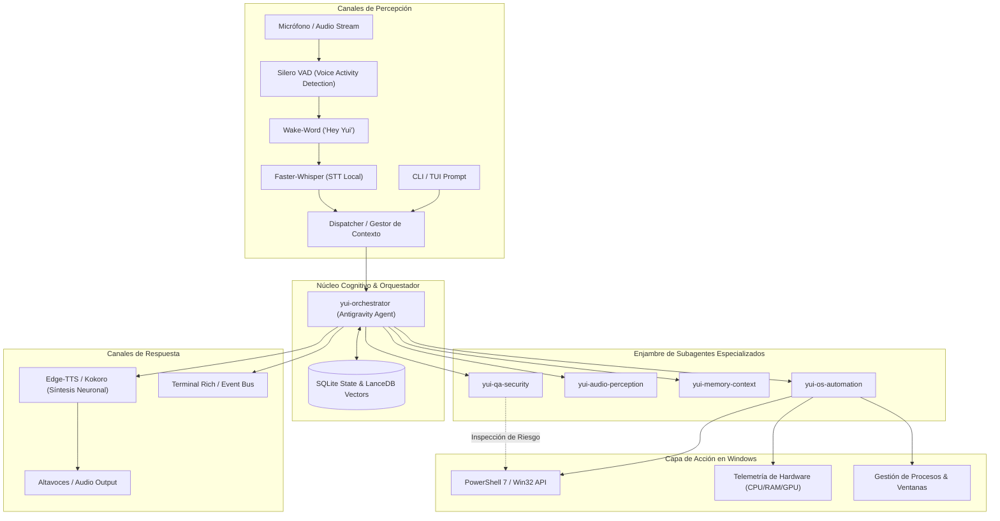

# Arquitectura del Sistema YUI (Next-Gen AI Companion)

## 1. Visión y Diagnóstico de la Industria

Los asistentes de voz comerciales tradicionales (Cortana, Siri, Google Assistant) fracasaron en el entorno de escritorio debido a tres limitaciones estructurales:

1. **Ausencia de Autonomía Ejecutiva**: Actúan como derivadores de búsquedas web en lugar de operadores del sistema.
2. **Arquitectura Rígida de Comandos**: Dependencia de árboles de decisión e intenciones fijas (regex / gramáticas formales) sin razonamiento heurístico ni comprensión contextual de la pantalla.
3. **Latencia Inasumible y Desconexión del Sistema Operativo**: Incapacidad de inspeccionar procesos en ejecución, leer búferes locales, o coordinar flujos de trabajo en segundo plano sin intervención humana constante.

**YUI** reimagina este paradigma como un **asistente de sistema operativo local-first y orientado a la acción**, articulado a través de un enjambre de agentes especializados gobernados por Antigravity.

---

## 2. Diagrama de Arquitectura Global

---

## 3. Matriz de Responsabilidades de los Agentes Antigravity

Cada agente cuenta con su manifiesto formal en `.agents/agents/<nombre>/agent.md`:

| Identificador | Dominio Técnico | Herramientas Clave | Objetivo Operativo |
| :--- | :--- | :--- | :--- |
| `yui-orchestrator` | Coordinación Cognitiva | `view_file`, `replace_file_content`, `run_command` | Parseo de intenciones, desglose de directrices y consolidación de respuestas. |
| `yui-os-automation` | Entorno Windows | `run_command`, `psutil`, `PowerShell` | Control de procesos, telemetría de hardware, gestión de archivos y scripts. |
| `yui-audio-perception`| Audio & Fonética | `sounddevice`, `faster-whisper`, `edge-tts` | Wake-word pasiva, transcripción continua, síntesis expresiva y barge-in. |
| `yui-memory-context` | Persistencia & RAG | `sqlite3`, `lancedb`, `duckdb` | Retención de preferencias, bitácora de auditoría y base de conocimiento local. |
| `yui-qa-security` | Seguridad & Calidad | `pytest`, análisis estático de comandos | Detección de patrones destructivos, pruebas unitarias y latencia. |

---

## 4. Pipeline Perceptual de Audio y Latencia

El objetivo crítico de interacción por voz es alcanzar una latencia de respuesta inferior a **600 ms**:

1. **Fase Pasiva (Bajo Consumo)**: Monitoreo de búfer circular mediante `sounddevice` y Silero VAD (16 kHz, mono). Consumo estimado: <1.5% CPU.
2. **Detección de Activación**: Tras detectar la palabra clave "Hey Yui", el búfer de audio se transfiere directamente a la memoria de trabajo.
3. **Transcripción en Streaming**: Inferencia con Faster-Whisper (cuantización `int8` en CPU o FP16 en GPU CUDA).
4. **Síntesis Neuronal y Barge-In**: Generación concurrente de chunks de audio con Edge-TTS; si el micrófono detecta voz del usuario durante la reproducción, la salida de audio se silencia instantáneamente.

---

## 5. Guardarraíles de Seguridad y Ejecución en el Sistema Operativo

YUI clasifica todo comando del sistema en cuatro niveles de riesgo:

* **SAFE**: Comandos de solo lectura (`Get-Process`, consultas de hardware, lectura de archivos permitidos). Se ejecutan de manera inmediata.
* **MODERATE**: Detención de procesos secundarios, creación o modificación de archivos en el espacio de trabajo. Requieren registro en auditoría.
* **HIGH / CRITICAL**: Comandos de borrado masivo, alteración del registro de Windows, formateo o detención de servicios esenciales. **Bloqueados automáticamente** a menos que el usuario emita confirmación explícita.
